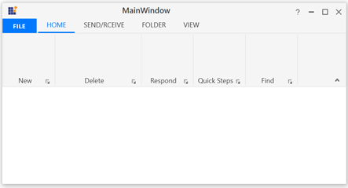

# Handle the LauncherClick Event in WPF Ribbon Control

This sample demonstrates how to handle the **LauncherClick** event in the **Syncfusion WPF Ribbon control**. The launcher button appears at the bottom‑right corner of a RibbonBar and is commonly used to provide additional actions or settings related to that group.

## Overview
In Ribbon‑based applications, each RibbonBar can display a launcher button that allows users to access advanced commands or dialogs associated with that group. This example shows how to subscribe to the `LauncherClick` event of a RibbonBar and execute custom logic when the launcher button is clicked.

The sample uses a RibbonWindow hosting a Ribbon with multiple tabs and ribbon bars, illustrating how launcher behavior can be customized at the RibbonBar level.

## What This Sample Demonstrates
- How to display the launcher button in a RibbonBar
- How to handle the `LauncherClick` event in WPF
- How to associate custom logic with a RibbonBar launcher
- How to organize ribbon groups within a RibbonTab
- How to build an Office‑style ribbon interface using Syncfusion controls

## Key Controls Used
- **RibbonWindow**: Hosts the Ribbon in a themed window
- **Ribbon**: Provides the ribbon UI container
- **RibbonTab**: Organizes ribbon content into tabs
- **RibbonBar**: Groups related commands and exposes the launcher button

## How It Works
1. A RibbonWindow is created and hosts a Ribbon control.
2. RibbonTabs are added to organize different command categories.
3. RibbonBars are defined within a RibbonTab.
4. A launcher button is enabled by handling the `LauncherClick` event.
5. When the launcher button is clicked, the corresponding event handler is invoked.

## Benefits
- Enables quick access to advanced commands or dialogs
- Improves ribbon usability by grouping related actions
- Maintains a clean and organized ribbon interface
- Provides flexibility for extending ribbon functionality
- Ideal for Office‑style WPF applications

This approach is useful for WPF applications that use Syncfusion Ribbon controls and need to handle launcher actions in a structured and user‑friendly way.

Output:

