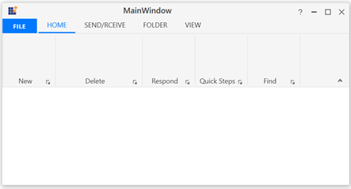

# How-to-handle-the-LauncherClick-event-in-WPF-Ribbon-control-
 This repository contains the sample that how to handle the LauncherClick event in WPF Ribbon control.
 
 The launcher button is present at the lower right corner of the RibbonBar in WPF Ribbon control. You can handle the launcher button by using the LauncherClick event. The launcher button is used to handle the RibbonBar items.
 
```XAML
<syncfusion:RibbonBar Name="Clipboard" Header="Clipboard" LauncherClick="Clipboard_LauncherClick"/>
```
```C#
//The code to handle the above event 
void ribbonbar_LauncherClick(object sender, RoutedEventArgs e)
{
    //events actions
}
```
Output:


 


